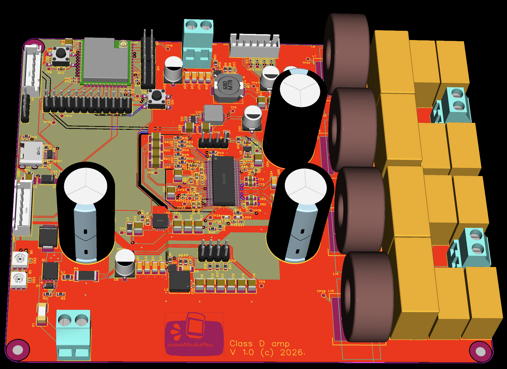

# NeatAmpTAS3251 — 2×170W Class D Amplifier with I2S Input & DSP

> ⚠️ **Hobby project** — no deadlines, no warranties, no guarantees. Use at your own risk.

<p align="center">

  

</p>

2×170 W Class-D amplifier based on the Texas Instruments TAS3251, featuring an ESP32-S3 controller, DSP-ready architecture, USB-C programming, and a low-noise multi-rail power supply.

---

## Overview

This project builds on the excellent [NeatAmpTAS3251](https://github.com/jmf13/NeatAmpTAS3251/tree/master)
design by jmf13 and extends it with:

- **ESP32-S3** — WiFi control, I2C management of TAS3251 (volume, EQ, fault monitoring)
- **Output inductors** — dual footprint for Coilcraft XGL1712-103MED and Würth 7443631000
  for comparative distortion testing
- **ADAU1466 DSP ready** — I2S input connector, power supply, and I2C interface prepared
  for future DSP integration
- **Revised power supply** — fully redesigned for lower noise and better thermal performance
- **EasyEDA Pro** — migrated from KiCad v9 for simplified JLCPCB prototyping workflow

---

## Release Notes

### Version 1.1
- **Important fix** — ESP32 USB-C connector was rotated 180° in V1.0, making the
  connector unusable when assembled. Now fixed.
- Added complete JLCPCB production specifications (see
  [Production Details](#production-details-jlcpcb)) as used for the first
  prototype batch.

### Version 1.0
- PCB routing completed for the first prototype revision.
- EasyEDA Pro project migrated to the new `.eprj2` project format.
- Development performed using **EasyEDA Pro V3.2.149**.
- Latest layout improvements include routing optimisation, power distribution refinement, grounding improvements, and thermal optimisation.

---

## Status

**Version:** 1.0 (Prototype)

⚠️ This is the first public prototype release. The hardware has **not yet been validated in real-world operation**. It should be considered experimental until prototype testing is completed.


---

## Power Supply Architecture

The power supply is a multi-rail design optimised for low noise on sensitive analog paths
while keeping thermal dissipation manageable across all operating conditions.

### Rail Overview

| Rail | Voltage | Chip | Purpose |
|------|---------|------|---------|
| PVDD | 36V | External PSU | TAS3251 output stage (H-bridges) |
| 13.2V | Buck | LMQ66410 | Intermediate rail for GVDD chain |
| 12V GVDD | LDO | TPS7A4701 | TAS3251 gate drive (GVDD_A, GVDD_B, VDD) |
| 5V | Buck | LMQ66430 | System 5V bus, USB-C OR node |
| 3.3V digital | Buck | AP63203 | ESP32-S3, STM32, ADAU1466, TAS DAC_DVDD |
| 3.3V analog | LDO | TPS7A2033 | TAS3251 DAC_AVDD only |

### 12V GVDD Chain — LMQ66410 → TPS7A4701

The gate drive supply uses a two-stage approach: a switching regulator handles the large
36V→13.2V step efficiently, followed by a low-noise LDO for the final 13.2V→12V drop. ESP32 senses GOOD_13.2V on IO39 and once stable, it triggers 12V analog power via IO38.

```
PVDD (36V) → LMQ66410 (buck, 1.25MHz) → 13.2V → TPS7A4701 (LDO) → 12V GVDD
```

- **LMQ66410**: 36V input, 1.25MHz switching frequency (RT = 39.2kΩ), feedback
  R_FBT = 49.9kΩ / R_FBB = 4.12kΩ
- **TPS7A4701**: 1A LDO, 4µVrms noise, 82dB PSRR @ 100Hz, output set via ANY-OUT
  pin programming to 12.0V (pins 0P2V + 0P8V + 3P2V + 6P4V1 → GND)
- A ferrite bead (BLM31PG121SN1L) is placed between the 13.2V rail and TPS7A4701
  input for additional HF noise isolation

> **Why two stages?** A direct linear regulator from 36V to 12V at even 50mA load
> would dissipate ~1.2W in a small SMD package. The buck + LDO combination keeps
> total dissipation under 0.8W while achieving better noise performance than a
> single-stage buck alone.

### 5V Rail — LMQ66430

```
PVDD (36V) → LMQ66430 (buck, 1.25MHz) → 5V
```

- Feedback: R_FBT = 49.9kΩ / R_FBB = 24.9kΩ
- Feeds the 5V OR node (see USB-C section)
- Sources the 3.3V digital buck and 3.3V analog LDO

### 3.3V Digital Rail — AP63203

```
5V OR rail → AP63203 (fixed 3.3V buck) → 3.3V digital
```

- Fixed 3.3V output — no external feedback resistors
- Powers: ESP32-S3, STM32F030, ADAU1466 digital, TAS3251 DAC_DVDD
- Starts automatically on power-up (EN tied to VIN)
- Output: 2× 10µF ceramic + 1× 47µF electrolytic

### 3.3V Analog Rail — TPS7A2033

```
5V OR rail → TPS7A2033 (LDO) → 3.3VA
```

- Ultra-low noise LDO: 7µVrms, 95dB PSRR
- Feeds **only** TAS3251 DAC_AVDD — kept isolated from noisy digital loads
- Enabled by default via 100kΩ pull-up to 3.3V digital; ESP32-S3 can disable via
  ENABLE_3.3V GPIO IO40 for controlled power sequencing
- Input/output decoupling: 1µF Samsung CL10B105KB8NQNC (C5199872) on both pins

### USB-C Power OR

The board supports powering the digital section from either the main 36V supply
or a USB-C connection, enabling ESP32-S3 programming without the main supply present.

```
PVDD (36V) → LMQ66430 → 5V → Schottky D1 ─┐
                                             ├─ 5V OR rail → AP63203 → 3.3V digital
USB-C VBUS (5V) ────────→ 1N5819 D2 ────────┘
```

- When 36V is present: LMQ66430 supplies the 5V OR rail; USB-C Schottky is
  reverse-biased
- When USB-C only (programming mode): USB VBUS supplies 3.3V digital via AP63203;
  TAS3251 analog section remains unpowered
- 1MΩ discharge resistor on VBUS for clean hot-plug behaviour

---

## Microcontroller — ESP32-S3 controlling TAS3251

The ESP32-S3-WROOM-1U-N8 acts as the system controller, handling WiFi connectivity,
TAS3251 configuration, real-time monitoring, and user interface.

For the ESP32-S3 firmware workspace, including the Python environment, ESP-IDF
6.0.2 setup, build commands, and editor configuration, see the
[ESP32-S3 firmware README](tas/README.md) before continuing with the hardware
interface details below.

### Interface to TAS3251

All TAS3251 runtime control is via I2C (400kHz Fast Mode). The I2C bus is shared
with the ADAU1466 when fitted.

| Signal | ESP32-S3 GPIO | TAS3251 Pin | Notes |
|--------|--------------|-------------|-------|
| SDA | GPIO IO0 | SDA (54) | 4.7kΩ pull-up to 3.3V |
| SCL | GPIO IO45 | SCL (53) | 4.7kΩ pull-up to 3.3V |
| RESET_AMP | GPIO out IO42 | /RESET_AMP (27) | Active low; 10kΩ pull-up to 3.3V (default: not in reset) |
| DAC_MUTE | GPIO out IO1 | DAC_MUTE (45) | Active low; 10kΩ pull-down to GND (default: muted at boot) |
| /FAULT | GPIO in + IRQ IO41 | /FAULT (28) | Open-drain; 10kΩ pull-up; falling-edge interrupt |
| /CLIP_OTW | GPIO in + IRQ IO2 | /CLIP_OTW (29) | Open-drain; 10kΩ pull-up; falling-edge interrupt |

### TAS3251 I2C Address

Set by ADR pin (46):
- ADR → GND: address **0x90**
- ADR → 3.3V: address **0x92**

This pin is connected to ESP32 IO12.

### What ESP32-S3 Controls via I2C

| Function | Register | Notes |
|----------|----------|-------|
| Power on/off | B0-P0-R2 | Startup/shutdown sequence |
| Volume (per channel) | B0-P0-R61/R62 | 0.5dB steps, −103dB to +24dB |
| Soft mute | B0-P0-R3 | Or via DAC_MUTE pin |
| EQ / crossover biquads | Book 0x8C pages | 15× BiQuad per channel; crossover HPF/LPF |
| Safeload (atomic update) | B0x8C-P5-R7C | Write 5 coefficients then set flag = 0x01 |
| Fault status read | B0-P0-R94/R95 | OC, UV, OTE, clock error — read after /FAULT IRQ |
| Volume ramp speed | B0-P0-R64 | Controls startup/shutdown ramp to prevent pops |

### Fault Handling

Both /FAULT and /CLIP_OTW are open-drain active-low outputs wired to ESP32-S3
interrupt-capable GPIOs. The recommended firmware flow:

1. /FAULT asserts → falling-edge ISR fires → read B0-P0-R94/R95 for fault detail
2. If OTE (over-temperature): wait for thermal recovery, then toggle RESET_AMP to
   clear the latched fault before resuming
3. /CLIP_OTW is non-latching — monitor for sustained clipping and reduce volume
4. Report fault status to Home Assistant via WiFi MQTT

### Visual Indicators

| LED | Colour | Condition |
|-----|--------|-----------|
| D_FAULT | Red | /FAULT asserted (hardware, no firmware needed) |
| D_CLIP | Yellow/Orange | /CLIP_OTW asserted (hardware, no firmware needed) |
| D_STATUS | WS2812B RGB | ESP32-S3 controlled: boot, WiFi, mute, active states |

Fault and clip LEDs are driven directly from the open-drain output through a 560Ω
resistor — they light up regardless of firmware state.

### Startup Sequence

```
Power applied
  → AP63203 starts → 3.3V digital available
  → ESP32-S3 boots (~150ms)
  → ESP32 initialises I2C
  → ESP32 asserts ENABLE_12V → TPS7A4701 enables → 12V GVDD available
  → TAS3251 comes out of reset (RESET_AMP released)
  → ESP32 writes TAS3251 configuration via I2C (volume, EQ, crossover)
  → ESP32 drives DAC_MUTE high → audio path unmuted
  → System ready
```

---

## I2S Audio Input

The board accepts I2S audio from either:

- **LHY Audio DIR9001 module** (SPDIF → I2S, 24-bit 96kHz) via 6-pin 2.54mm connector
- **ADAU1466 DSP board** (future) via the same I2S connector
- **ESP32-S3 directly** (for testing/streaming) via the same GPIO pins

I2S connector pinout (2.54mm, 6-pin vertical):

| Pin | Signal |
|-----|--------|
| 1 | DATA (SDIN) |
| 2 | BCLK |
| 3 | LRCK |
| 4 | MCLK |
| 5 | +5V |
| 6 | GND |

27Ω series resistors are placed on all four signal lines between the connector and
TAS3251/ESP32-S3 for signal integrity and EMI reduction.

---

## Known Issues from Original Design

> As noted by the original author:
> - Silkscreen polarity for **C25, C26, C27, C28** was inverted — caps replaced with
>   non-polarised X7R ceramics in this revision, resolving the issue entirely.
> - Heatsink footprint required rework — addressed in PCB revision.

---

## Production Details (JLCPCB)

The first prototype batch (5 boards, V1.0/V1.1) was manufactured and assembled by
JLCPCB with the settings below. These are provided as a validated reference for
anyone reproducing the board.

### PCB Fabrication

| Parameter | Value |
|-----------|-------|
| Layers | 4 |
| Base Material | FR-4, TG155 |
| Dimensions | 155.45 × 134.33 mm |
| PCB Thickness | 1.6 mm |
| PCB Color / Silkscreen | Blue / White |
| Outer Copper Weight | 2 oz |
| Inner Copper Weight | 1 oz |
| Surface Finish | ENIG, Gold Thickness 1U" |
| Via Covering | Plugged |
| Min Via Hole/Diameter | 0.3 mm / (0.4/0.45 mm) |
| Electrical Test | Flying Probe Fully Test |
| Mark on PCB | Remove Mark |
| Appearance Quality | IPC Class 2 Standard |
| Board Outline Tolerance | ±0.2 mm (Regular) |
| Delivery Format | Single PCB |
| Silkscreen Technology | Ink-jet Printing |
| Build Time | 3 days (PCB only) |
| Weight (5 pcs) | 0.89 kg |

> **Why these choices:** TG155 handles output-stage heat better than standard
> TG135. ENIG provides flat pads which significantly improves assembly yield on
> the fine-pitch QFN packages (TAS3251 VQFN-56, LMQ66430 VQFN-14, TPS7A4701
> VQFN-20). Plugged vias are required for the via-in-pad thermal grid under the
> TAS3251 exposed pad. 2 oz outer copper carries the high-current speaker output
> and PVDD paths.

### SMT Assembly

| Parameter | Value |
|-----------|-------|
| PCBA Type | Standard |
| Assembly Side | Top Side |
| PCBA Qty | 5 |
| Edge Rails/Fiducials | Added by JLCPCB |
| Confirm Parts Placement | Yes |
| Bake Components | Yes |
| Photo Confirmation | Yes |
| Board Cleaning | Yes |
| Depanel & remove edge rails before delivery | Yes |
| Solder Paste | High temp. |
| Nitrogen Reflow Soldering | No |
| Flying Probe Test (post-assembly) | No |
| Function Test | No |
| Conformal Coating | No |
| Packaging | Antistatic bubble film |
| Panel Format | 1 × 1 |
| Build Time | 5–6 days (+4 days) |
| Product Classification | Audio Amplifiers — HS Code 851890 |
| Weight (5 assembled boards) | 2.29 kg |

> **Recommended for first runs:** *Confirm Parts Placement* and *Photo
> Confirmation* let you verify component orientation before reflow — worth it on
> any board with polarised or directional parts. *Board Cleaning* removes flux
> residue that could otherwise cause leakage currents on the high-impedance
> analog nodes (DAC_AVDD, AGND area).

### Not Assembled by JLCPCB (manual population)

The following components are excluded from the SMT order
(`Add into BOM = No` in EasyEDA) and must be hand-soldered:

- **L7–L14** — output filter inductors (Coilcraft XGL1712-103MED and
  Würth/Codaca MA5172-AE dual footprints) — order from Mouser
- **TP1–TP30** — test points (optional)

---

## Enclosure

⚠️ The supplied enclosure / 3D shell has **not passed the JLCPCB manufacturing review** and is **not recommended for fabrication** in its current state. It is included for reference only and requires redesign before production.

---

## Original Project

- Original design: [jmf13/NeatAmpTAS3251](https://github.com/jmf13/NeatAmpTAS3251/tree/master)
- License: [CC BY-SA 4.0](https://creativecommons.org/licenses/by-sa/4.0/) —
  this project inherits the same license.

---

## EasyEDA Pro Setup

**Recommended EasyEDA Pro version:** **V3.2.149**.


This repository includes a custom component library. To use it, create a symbolic
link inside your EasyEDA Pro libraries directory.

### macOS / Linux

```bash
# Navigate to your EasyEDA Pro libraries directory
cd ~/Documents/EasyEDA-Pro/libraries

# Create symlink to files from there so that app recognizes it
ln -s /path/to/git/NeatAmpTAS3251/EasyEDA-Pro/libraries/* .
```

### Windows

```cmd
:: Run Command Prompt as Administrator
cd %USERPROFILE%\EasyEDA-Pro\libraries

:: Create directory symlink
mklink /D NeatAmpTAS3251-lib C:\path\to\NeatAmpTAS3251\library
```

After creating the symlink, restart EasyEDA Pro. The library will appear in the
**Libraries** panel under `NeatAmpTAS3251-lib`.

> **Note:** Replace `/path/to/NeatAmpTAS3251/library` with the actual path where
> you cloned this repository. The EasyEDA Pro libraries directory location may vary
> by OS version — check your EasyEDA Pro installation settings if the default path
> above does not exist.
